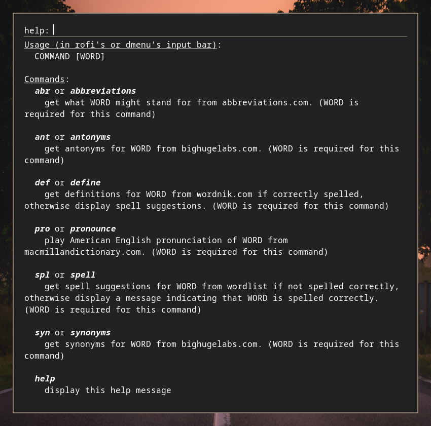

# rofi_et

rofi_et is a rofi script with features to aid you with English.

## Features

- [x] Spellcheck and suggestions (offline, based on a wordlist)
- [x] Define (online, based on wordnik)
- [ ] Synonyms (will probably use wordnik)
- [ ] Antonyms (will probably use wordnik)
- [ ] Abbreviations (not planned yet)

## Dependencies

> The installation script won't install the dependencies for you because I don't know the package names on distros other than Arch

- `rofi` (of course) from `rofi` package on Arch
- `xclip` from `xclip` package on Arch => to copy selected spelling suggestion to clipboard
- `notify-send` from `libnotify` package on Arch => to notify you on copying a spelling suggestion to clipboard
- `agrep` from `tre` package on Arch => to do fuzzy searching in the wordlist to get spelling suggestions

## Installation

1. close this repo => `git clone https://github.com/PlankCipher/rofi_et.git`
2. cd into the cloned repo directory
3. run `install.sh` => `./install.sh`
4. Voila 🎉

> You will be asked to enter your password for sudo to move the executable to `/sbin/rofi_et` so that it's accessible from anywhere

## Usage

## Credits

- I got `words_alpha` wordlist from [this](https://github.com/dwyl/english-words) repo.
- Wordnik's website is used to get definitions.

## Contributions

Contributions are very welcome.
